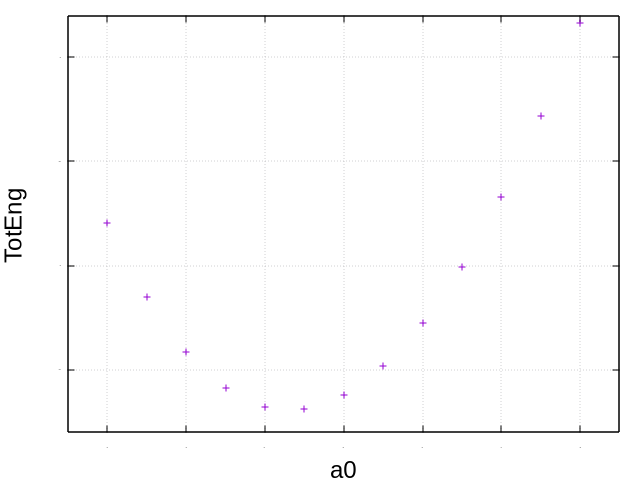
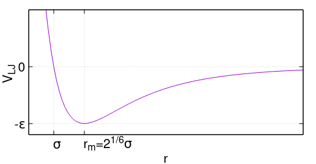
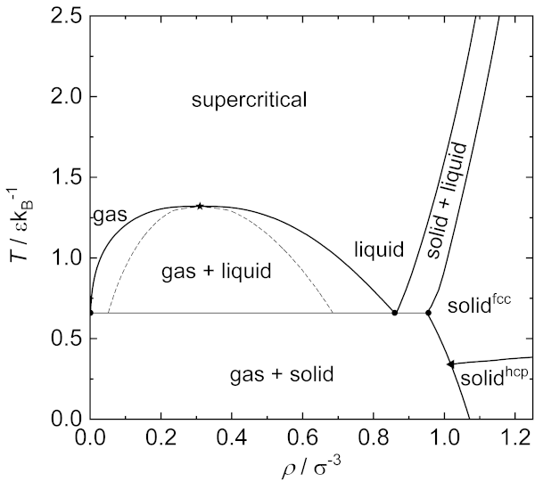
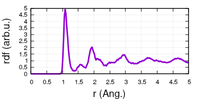
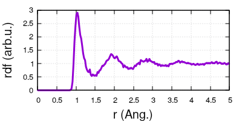
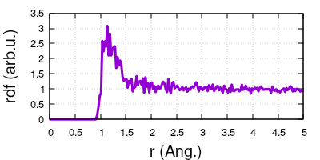

- [Exercise 1: Generating a crystal structure](#sec-1)
  - [Part A: Generate an FCC structure in the cubic (conventional) cell:](#sec-1-1)
  - [Part B: Generate an FCC structure in the primitive cell:](#sec-1-2)
  - [Part C: Create and visualize a 4x4x4 supercell](#sec-1-3)
  - [EXTRA:](#sec-1-4)
- [Exercise 2: Determine the lattice constant of Si diamond crystal](#sec-2)
  - [Part A: Generate Si crystal in the diamond configuration](#sec-2-1)
  - [Part B: computing the lattice constant of Si](#sec-2-2)
  - [EXTRA:](#sec-2-3)
- [Exercise 3: velocity Verlet, Lennard-Jones, Molecular Dynamics](#sec-3)
  - [Verlet-Stormer](#sec-3-1)
  - [velocity-Verlet](#sec-3-2)
  - [Computing the Energy and Force (classical potentials: LJ)](#sec-3-3)
  - [Molecular Dynamics](#sec-3-4)
  - [A word on statistical ensembles](#sec-3-5)
  - [Part A: LJ solid](#sec-3-6)
  - [Part B: LJ liquid](#sec-3-7)
  - [Part C: LJ gas](#sec-3-8)
  - [EXTRA:](#sec-3-9)
- [Exercise 4: Optimization of a structure](#sec-4)
  - [Driven-damped dynamics](#sec-4-1)
  - [Minimization, relaxation, geometry optimization](#sec-4-2)
  - [Part A: Minimize a LJ structure](#sec-4-3)
  - [EXTRA:](#sec-4-4)
- [EXTRA 1: The lammps examples](#sec-5)
- [EXTRA 2: phonons with LJ](#sec-6)
- [Some more resources:](#sec-7)


# Exercise 1: Generating a crystal structure<a id="sec-1"></a>

## Part A: Generate an FCC structure in the cubic (conventional) cell:<a id="sec-1-1"></a>

Face-Centered Cubic (FCC) structure is characterised by one atom at the origin of the cubic cell, and one atom at the center of each face of the cubic cell (thus 4 atoms per cell). This is also called the conventional cell of FCC.

The lattice vectors are:

```python
a1 = [ 1.0, 0.0, 0.0 ]
a2 = [ 0.0, 1.0, 0.0 ]
a3 = [ 0.0, 0.0, 1.0 ]
```

and 4 atomic basis vectors; one at the origin, and one at the center of each face:

```python
Natoms = 4

basis[0] = [ 0.0, 0.0, 0.0 ]
basis[1] = [ 0.5, 0.5, 0.0 ]
basis[2] = [ 0.5, 0.0, 0.5 ]
basis[3] = [ 0.0, 0.5, 0.5 ]
```

1.  Modify the `generate_cell.py` script to generate the conventional cell of FCC structure, as given above. Call the script with `python`, and redirect the output to a file:
    
    ```bash
       python generate_cell.py > my_output_filename.xyz
    ```

2.  Use `ovito` program to visualize the xyz output, draw bonds between the atoms.

## Part B: Generate an FCC structure in the primitive cell:<a id="sec-1-2"></a>

The cubic cell is however not the primitive cell of FCC. The primitive cell of FCC has rhombohedral lattice vectors with all angles equal at 60 degrees:

```python
a1 = [ -0.5, 0.0, 0.5 ]
a2 = [  0.0, 0.5, 0.5 ]
a3 = [ -0.5, 0.5, 0.0 ]
```

and one atom at the origin of the cell:

```python
Natoms = 1
basis[0] = [ 0.0, 0.0, 0.0 ]
```

1.  Modify the `generate_cell.py` script to generate the primitive cell of FCC structure. Use `ovito` program to visualize the output.

## Part C: Create and visualize a 4x4x4 supercell<a id="sec-1-3"></a>

1.  Modify the `generate_cell.py` script to generate 4x4x4 supercells of both structures generated above.

2.  Use `ovito` to visualize. The script will generate two structures in the same output file: one for the unit cell, and one for the supercell. Navigate the structures in `ovito`.

3.  Test the structure of your supercell in ovito, using the modifier "Polyhedral Template Matching". You might need to tick the boxes "cubic diamond" or "hexagonal diamond".

## EXTRA:<a id="sec-1-4"></a>

### EXTRA-1.1: Performing the inverse operation:<a id="sec-1-4-1"></a>

In the script, the atomic positions are written in the crystal (fractional) coordinates, which are then transformed by matrix multiplication into the cartesian coordinates for output. How would you perform the inverse operation? That is, how to go from cartesian coordinates back to the crystal coordinates, given the matrix of lattice vectors?

### EXTRA-1.2: constraints on the lattice vectors:<a id="sec-1-4-2"></a>

In terms of their direction and norm, is there any constraint on the lattice vectors?

Hint: The determinant of the matrix of lattice vectors gives the absolute value of the volume of the cell; which can also be computed by the scalar triple product: a1.(a2 x a3).

Physically, is it meaningful for the volume of a cell to be zero? Can the lattice vectors be coplanar, or collinear? What does it mean if a matrix has determinant equal to zero? What happens to the metric tensor aTa?

### EXTRA-1.3: Implementing `cart_to_cryst` and `cryst_to_cart`:<a id="sec-1-4-3"></a>

Try to implement the transformations from cartesian to crystal, and from crystal to cartesian coordinates, in your favourite programming language.

### EXTRA-1.4: Implementing the Periodic Boundary Conditions:<a id="sec-1-4-4"></a>

With the tools from previous question, it is straight-forward to implement the Periodic Boundary Conditions (PBC).

The atomic positions expressed in crystal coordinates are limited to the range [0:1). Based on this, we can write a loop to perform PBC on each vector of atomic positions:

```python
for i in range(Natoms):
    # transform from cartesian to crystal coordinates
    vec[i] = cart_to_cryst( vec[i], lattice )
    # check condition for position: in crystal coordinates should be on the range [0:1)
    vec[i] = periodic( vec[i] )
    # transform from crystal back to cartesian coordinates
    vec[i] = cryst_to_cart( vec[i], lattice )
```

Try to implement the loop sketched above in your favourite programming language.

PS: It is possible to compute distances between atoms in PBC using such routines. However, then it's better to shift the range [0:1) to [-0.5:0.5). Do you have any idea why that is? Try to sketch what is happening.

# Exercise 2: Determine the lattice constant of Si diamond crystal<a id="sec-2"></a>

## Part A: Generate Si crystal in the diamond configuration<a id="sec-2-1"></a>

Diamond lattice is composed of two FCC lattices shifted by 0.25.

The convetional cell is cubic, with lattice vectors:

```python
  a1 = [ 1.0, 0.0, 0.0 ]
  a2 = [ 0.0, 1.0, 0.0 ]
  a3 = [ 0.0, 0.0, 1.0 ]
```

and two unit cells of FCC, shifted by 0.25:

```python
  Natoms = 8

  basis[0] = [ 0.0, 0.0, 0.0 ]
  basis[1] = [ 0.5, 0.5, 0.0 ]
  basis[2] = [ 0.5, 0.0, 0.5 ]
  basis[3] = [ 0.0, 0.5, 0.5 ]
  basis[4] = [ 0.25, 0.25, 0.25 ]
  basis[5] = [ 0.75, 0.75, 0.25 ]
  basis[6] = [ 0.75, 0.25, 0.75 ]
  basis[7] = [ 0.25, 0.75, 0.75 ]
```

1.  Create the diamond structure in the conventional (cubic) cell, as given above. Verify the output structure by visualization.

## Part B: computing the lattice constant of Si<a id="sec-2-2"></a>

We can compute the lattice constant of a crystal, by finding the value of `a0` which minimizes the total energy of the cell. In this exercise, we do the task manually, meaning we explicitly select some values of `a0`, generate the structure with given `a0`, compute the corresponding energy, and plot the curve. The curve can then be fitted with a polynomial to find the exact value of `a0` at the minimum.

If you feel confident in scripting, skip directly to EXTRA-2.1.

1.  Generate the diamond structure with several different values of the lattice constant `a0`. The range of values should be around 5.2 to 5.8.
    
    Use the `generate_cell.py` script from the previous exercise to create `.xyz` files with the different structures.

2.  Compute the value of total energy for each `a0`. Use LAMMPS software to compute the energy.
    
    a) Unfortunately, `lammps` does not understand the `.xyz` file format with our structure. Use the python script `xyz2lmp.py` to convert from `.xyz` to `.lmp` format. Save the output to file `struc.lmp`:
    
    ```bash
        python  xyz2lmp.py  struc_a0.xyz  >  struc.lmp
    ```
    
    NOTE: the `.lmp` file format can also be viewed by `ovito`.
    
    b) Open the lammps input file `lammps.in`, and make sure the structure is read from appropriate `struc.lmp` file, the one you saved in the previous step. It is specified in the line:
    
    ```bash
        read_data  struc.lmp
    ```
    
    c) Launch `lammps` with the command `lmp`, giving the input file `lammps.in` as:
    
    ```bash
        lmp -in lammps.in
    ```
    
    this will produce some output on the screen. Search for the line that says: "TotEng". The value printed after it is the total energy of your system.
    
    Save the current value of `a0`, together with the corresponding total energy value into a file. The goal is to produce a file with contents (`a0` in first column, and total energy in the second):
    
    ```txt
        5.20  	-33.795071
        5.25  	-34.151899
        5.30  	-34.414694
        5.35  	-34.588440
        5.40  	-34.677817
        5.45  	-34.687223
        5.50  	-34.620807
        5.55  	-34.482483
        5.60  	-34.275956
        5.65  	-34.004740
        5.70  	-33.672175
        5.75  	-33.281449
        5.80  	-32.835608
    ```
    
    Which can then be plotted by your favourite plotting tool (e.g. `gnuplot`), to produce something like:
    
    

## EXTRA:<a id="sec-2-3"></a>

### EXTRA-2.1: Write a `bash` script<a id="sec-2-3-1"></a>

Create a `bash` script to compute the total energy corresponding to a range of values `a0`. The steps should generally follow the ones outlined in exercise description.

A possible script is written in the file `scripting/script.sh`. Can you make any sense of it?

### EXTRA-2.2: Find a polynomial fit to the data<a id="sec-2-3-2"></a>

Use your favourite programming language to write a functional fit to the data, and extract the value of the minimum `a0`.

### EXTRA-2.3: Compute with the primitive cell of diamond<a id="sec-2-3-3"></a>

Modify the script to work with the primitive cell of diamond, and plot the result. What differences do you see (in terms of values of total energy, or `a0`)?

### EXTRA-2.4: How about a supercell?<a id="sec-2-3-4"></a>

Repeat the exercise with some supercell instead of the unit cell. Do you get any differences? Why?

# Exercise 3: velocity Verlet, Lennard-Jones, Molecular Dynamics<a id="sec-3"></a>

## Verlet-Stormer<a id="sec-3-1"></a>

In a computer, the first-order derivatives are computed as finite-difference:

$$ \frac{\mathrm{d}}{\mathrm{d}t}x(t) = \frac{ x(t+\Delta t) - x(t) }{\Delta t} $$

with a chosen small value of $\Delta t$.

Let's label the positions as function of the timestep:

-   the current positions $x(t)=x_n$;
-   the positions in the next time-step $x(t+\Delta t)=x_{n+1}$;
-   the positions in the previous timestep $x(t-\Delta t)=x_{n-1}$.

Then, the second-order derivatives are computed as difference-of-differences:

$$ \frac{\mathrm{d}^2}{\mathrm{d}t^2} x(t) = \frac { \frac{ x_{n+1} - x_n }{\Delta t} - \frac{ x_n - x_{n-1} }{\Delta t} }{\Delta t} = \frac { x_{n+1} - 2x_{n} + x_{n-1} } { \Delta t^2} $$

Then we can write the Newton's equation of motion:

$$ F = ma = m \frac{\mathrm{d}^2}{\mathrm{d}t^2} x(t) = m \frac { x_{n+1} - 2x_{n} + x_{n-1} } { \Delta t^2} $$

Reshuffling the terms, to solve for positions in the next time-step:

$$ x_{n+1} = 2x_n - x_{n-1} + \frac{F \Delta t^2}{m} $$

Therefore, to compute the future positions of atoms, we need to know the current positions, the positions of the previous time-step, and the force at the current time step.

The instantaneous force is a quantity which depends on the level of theory we want to include, but it can always be computed from the available data. At the simplest level, it's a function of the chemical type, and interatomic distances.

This is the basic Verlet-Stormer algotihrm for the update of atomic positions. Solving it for a number of timesteps $\Delta t$ makes a trajectory, which is just one of the possible solutions of the equation of motion.

## velocity-Verlet<a id="sec-3-2"></a>

The knowledge of positions at the previous time-step of the basic Verlet-Stormer algorithm poses a challenege when initiating the simulation, but can be overcome by the velocity-Verlet algorithm.

The velocity-Verlet algorithm uses particle velocities and forces to calculate the position update. The algorithm follows three steps:

-   calculate the future positions from current positions, current velocity, and current force:

$$ x_{n+1} = x_n + v_n \Delta t + \frac{1}{2}F_n\Delta t^2 $$

-   compute the future force $F_{n+1}$ at positions $x_{n+1}$;
-   compute the future velocities:

$$ v_{n+1} = v_{n} + \frac{1}{2}(F_n + F_{n+1})\Delta t $$

In order to start the velocity-Verlet algorithm, we need to provide the initial positions, and velocities.

## Computing the Energy and Force (classical potentials: LJ)<a id="sec-3-3"></a>

The instantaneous force on a configuration of particles $F_n$ can be computed at several different levels of theory. In this section we look at the [Lennard-Jones](https://en.wikipedia.org/wiki/Lennard-Jones_potential) (LJ) potential, which is possibly the simplest pair-potential. It gives the potential energy of two interacting objects, as the function of only the distance $r$ between them. As it does not contain any electronic effects, LJ is often referred to as a "classical" potential. Many other potentials of this type exist.

The LJ potential is defined:

$$ V_{LJ}(r) = 4\epsilon \bigg[ \big(\frac{\sigma}{r}\big)^{12} - \big(\frac{\sigma}{r}\big)^{6} \bigg] $$

where $\epsilon$ is the potential depth, and $\sigma$ is the value of distance where $V_{LJ}=0$. It reaches a minimum value at $r=r_{m}=2^{1/6}\sigma$.

Sometimes it is convenient to write it as:

$$ V_{LJ}(r) = \frac{A}{r^{12}} - \frac{B}{r^{6}} $$



The force can be in general computed as the negative gradient of the potential, but $V_{LJ}$ is spherically symmetric, so the force direction is given by the vector $\hat{r}$, and its magnitude by the simple derivate, with an analytical expression:

$$ \vec{F}_{LJ}( \vec{r} ) = -\hat{r}\frac{\mathrm{d}V}{\mathrm{d}r} = \hat{r} 48\epsilon \bigg[ \frac{\sigma^{12}}{r^{13}} - 0.5 \frac{\sigma^{6}}{r^{7}} \bigg] $$

where $\vec{r}$ is the vector connecting two particles, $r$ is its Cartesian norm, and $\hat{r} = \vec{r}/r$ its direction.

### The total energy<a id="sec-3-3-1"></a>

The energy on particle $i$ is the sum of the $V_{LJ}$ contribution from all particles $j$:

$$ E_i = \sum_{j \ne i} V_{LJ}(r_j) $$

where $r_j$ is the distance from particle $i$ to $j$ in periodic boundary conditions.

The total energy of a LJ system is then the sum of the per-particle energy $E_i$ over all particles $i$:

$$ E_{tot} = \sum_i E_i $$

### The total force<a id="sec-3-3-2"></a>

Similarly to the energy, the force on any single particle $i$ is the sum of force contributions by all particles $j$:

$$ \vec{F}_i = \sum_{j \ne i} \vec{F}_{LJ}( \vec{r}_j ) $$

## Molecular Dynamics<a id="sec-3-4"></a>

Molecular Dynamics (MD) is a simulation technique which generates a trajectory of configurations, which is a possible solution of the equations of motion. By changing the initial conditions, MD generates a different trajectory which is also a valid solution.

Very often, the concrete method of computing the atomic update step is similar (if not identical) to the one sketched above (the velocity-Verlet). The computation of force can however be much more involved, by including effects at several levels of theory (classical, semi-classical, QM/MM, ab-initio, etc.).

Once we have an equilibrated, and long-enough trajectory, we can compute some thermodynamic properties from the trajectory. Namely, we can compute those that can be expressed as functions of positions and momenta of the particles. For example particle density, which gives the average distance between particles, and temperature, expressing the average kinetic energy per particle.

## A word on statistical ensembles<a id="sec-3-5"></a>

Depending on which statistical ensemble we wish to simulate (canonical, micro-canonical, or grand-canonical), different thermodynamic properties are kept constant in the simulation, while others can vary.

In a classical simulation, the velocities of particles at a given temperature are spread over a Maxwell-Boltzmann distribution arising due to elastic collisions. Thus if we wish to simulate a system at a certain constant temperature, the particle properties (velocity) have to be scaled to meet the temperature criteria. There exist different schemes for such rescaling, commonly called the "thermostats".

Similarly, if we wish to simulate a system at a certain constant pressure, the box size has to be scaled, for which the different schemes are called "barostats".

The different ensembles are often referred to by which properties are constant:

-   micro-canonical NVE: the number of particles/moles $N$, box volume $V$, and the energy $E$. This corresponds to an isolated system, which does not exchange heat or matter with its surrounding. The total energy in NVE is coserved (i.e. the sum of kinetic and potential $E=K+V$).

-   canonical NVT: the number of particles/moles $N$, box volume $V$, and the temperature $T$. The system is allowed to exchange energy (heat) with its surrounding, such that $T$ remains constant. Velocities rescaled with a thermostat, to keep constant the kinetic energy (=temperature).

-   isothermal-isobaric NPT: the number of particles/moles $N$, the pressure $P$, and temperature $T$. The system is allowed to exchange energy (heat), and change the volume (box size) to keep the pressure constant. The pressure is manipulated by rescaling the box, via a barostat.

-   grand-canonical $\mu$-VT: the chemical potential $\mu$, volume $V$, and temperature $T$. The system is assumed open, and can exchange heat (energy), and particles (matter, chemical elements) with its surrounding. The exchange of particles is very difficult to properly implement in MD, some Monte-Carlo based methods exist though.

## Part A: LJ solid<a id="sec-3-6"></a>

In this exercise, we will perform MD simulation of a LJ system at some fixed conditions of density and temperature. We fix the potential parameters `epsilon` and `sigma` both to equal 1.0.

The initial structure is specified in the file `lj_box.lmp`, it contains a 10x10x10 supercell of a simple cubic lattice, with the lattice constant `a0` equal to `1.0`. Thus it's a cubic cell of size 10.0, containing in total 1000 atoms.

Below is a phase diagram for a LJ substance. The size of our box and number of particles fixes the particle density $\rho=1.0$. First let's choose a temperature value $T=0.4$ (in LJ units), which should correspond to a solid phase, with FCC crystal structure.



1.  Use LAMMPS software to perform MD. The input file is located at `LJ_md/lammps.in`.
    
    Launch the calculation in parallel with the command (it can take around 20 seconds):
    
    ```bash
        mpirun lmp -in lammps.in
    ```
    
    This will output thermodynamics data directly to screen, and a copy of the same data into `log.lammps` file.

2.  The output structure is written in the file `dump.dat`. This file contains a number of images from the trajectory generated by lammps. Visualize the trajectory with `ovito`.
    
    Navigate to the final structure in the trajectory, and try to identify if any regular structure has appeared.
    
    Use the modifier "Coordination analysis" to plot the radial distribution function (RDF). Compare the RDF of initial and final configurations in the trajectory.
    
    
    
    RDF gives information of the distribution of distances between atoms. The first peak corresponds to the first neighbour shell, second peak to the second neighbor shell, and so on. The well-defined peaks in the RDF are clear sign of a solid structure, since atoms are placed at specific distances from each other.

3.  Open the file `log.lammps`, and delete the header and footer lines, keeping just the thermodynamic data. Plot the total energy `TotEng` of the simulation.
    
    At which point do you think the simulation is well equilibrated/thermalized?
    
    MD simulations are highly susceptible to the initial configuration of the simulation. If that is far from expected structure at specified simulation conditions, it might take many steps to thermalize.

## Part B: LJ liquid<a id="sec-3-7"></a>

Now we raise the temperature to $T=1.8$ in LJ units, and keep the same particle density. Checking the phase diagram, this point should correspond to a liquid structure.

1.  Open the lammps input file `lammps.in` and modify the Berendsen thermostat temperature values from 0.4 to 1.8 in the line:
    
    ```bash
       fix             2 all temp/berendsen   0.4   0.4   2.0
    ```
    
    to become:
    
    ```bash
       fix             2 all temp/berendsen   1.8   1.8   2.0
    ```
    
    Now launch lammps the same as previously:
    
    ```
       mpirun lmp -in lammps.in
    ```

2.  Visulaize the output `dump.dat`, and plot the RDF with the modifier "Coordination analysis". What differences do you see in the RDFs?
    
    Liquid structure is characterized by structural order on short range, and no order on the long range. The RDF contains a well-defined first peak, followed by a few broader peaks, until becoming flat.
    
    

## Part C: LJ gas<a id="sec-3-8"></a>

In the Part B, we moved from solid to liquid on the phase diagram by keeping the density constant, and raising the temperatrue (vertical axis on the phase diagram).

In Part C, we simulate a gas phase of LJ, for which we move on the horizontal axis of the phase diagram, all the way to very low density $\rho\approx 0.1$, and $T=1.0$.

1.  Given the density as $\rho = N/V$, and the volume being $V=a^3$, what side-length $a$ of the cube do we need to obtain density $\rho \approx 0.1$ with $N=1000$ particles?

2.  The input cubic structure is written in the file `lj_box.lmp`.
    
    We can modify the box size by hand, replace the lines:
    
    ```
       0.0   10.0  xlo xhi
       0.0   10.0  ylo yhi
       0.0   10.0  zlo zhi
    ```
    
    by:
    
    ```
       0.0   21.5  xlo xhi
       0.0   21.5  ylo yhi
       0.0   21.5  zlo zhi
    ```
    
    This should increase the simulation box from 10.0 to 21.5, which corresponds to $\rho \approx 0.1$. However, the atomic positions did not change by this modification. Thus we now have a large simulation box containing a cubic atomic structure that is surrounded by vacuum.
    
    The modified configuration is now far from being a gas-phase as we would like to simulate.
    
    Launch the LAMMPS simulation and visualize the output.
    
    We might need to perform a longer simulation to get a nice gas phase structure, modify the number of simulation steps, in the last line of the lammps input file:
    
    ```
       run    30000
    ```

3.  Draw the RDFs and compare with RDFs from solid, and liquid phases.
    
    The gas phase is characterized by no structural order at all. The first peak is already broadened, and the RDF contains no other significant peaks.
    
    

## EXTRA:<a id="sec-3-9"></a>

### EXTRA-3.1: significance of `epsilon` and `sigma`<a id="sec-3-9-1"></a>

Imagine you try to model a real molecule with two atoms with the LJ potential. Which experimantal (or computed) values of the molecule would you need, in order to determine `epsilon`? And which to determine `sigma`?

### EXTRA-3.2: significance of `timestep`<a id="sec-3-9-2"></a>

Attempt to play with the value of `timestep` in the lammps input.

A too large value can induce "box explosion" in lammps, which means two atoms have been moved very close together in a single step, such that the repulsive force between them is very large, which generates huge velocity, and the particles in the subsequent step have displaced by more than half the size of simulation box.

A too small value means there is not much change between two successive steps, and thus the computer is re-computing properties which did not change a lot. That is an unnecessary waste of computer time.

### EXTRA-3.3: significance of the cutoff<a id="sec-3-9-3"></a>

In the exercise we used the cutoff value of LJ at 2.5, which means any interaction of atoms which are more than 2.5 distance units apart is not taken into account explicitly.

What do you think is the effect of this choice on the simulation, regarding the computation speed? How about accuracy?

Try to repeat the calculation(s) with larger value of the cutoff, do you notice any differences?

### EXTRA-3.4: highly symmetric initial configurations<a id="sec-3-9-4"></a>

Did you notice any behaviour during the MD simulations, that seemed strangely symmetric for no reason?

If not, try to reduce the printing frequency `Nprint` to 50 or so, and repeat the simulation of the solid phase.

What happens to the forces when the atoms are placed in a strictly symmetric arrangement, and what does this mean for the dynamic propagation of a structure?

In many cases when simulating dynamical properties, it is a good idea to break the strict numerically equivalent symmetries of a system, since they might impose unreal constraints to the forces, and thus bias the dynamics of a system in an unwanted way.

The lammps input file `lammps.in` contains a commented line which gives a small displacement to the initial configuration, just enough to break the strict numerical equivalence:

```
#displace_atoms  all random 0.05 0.05 0.05 1234
```

Uncommenting this line should remove the symmetric behaviour of the simulation.

### EXTRA-3.5: implement your own module to compute LJ energy and force:<a id="sec-3-9-5"></a>

Using your favourite programming language, implement functions/routines to compute the total energy, and the force vectors for a given configuration of particles. Use lammps calculations as reference values.

NOTE: keep in mind the distances have to be computed in Periodic Boundary Conditions.

NOTE 2: the range of distances where LJ gives a nonzero potential can be quite large, meaning we need to explicitly include a quite large cell in the calculation. In the generic PBC implementation, each image is only made to interact with its nearest-neighbor image, but not the second, third, etc. This is often mitigated by introducing a cutoff range to the LJ interactions, beyond which the interactions are added as analytical expressions based on the density.

### EXTRA-3.6: compute which Bravais lattice has the lowest LJ energy<a id="sec-3-9-6"></a>

Use the script `generate_cell.py` from the first exercise to generate the Simple Cubic (SC), Face-Centered Cubic (FCC), Body-Centered Cubic (BCC), and Hexagonal Close-Packed (HCP) structures. Then choose parameters for the `epsilon` and `sigma`, and find the lattice constant `a0` for each crystal lattice. Which crystal structure has the lowest energy?

The energy values for FCC and HCP are quite close, generate a (very) large supercell for each lattice, and compute the total energy per atom.

FCC and HCP are the lowest energy structures. They are the most stable, and coincidentally appear most often in the nature. The simple LJ potential is already sufficient to reproduce that behaviour of nature; remember LJ only has a radial component.

### EXTRA-3.7: implement your own Verlet algorithm:<a id="sec-3-9-7"></a>

Using your favourite programming language, implement the Velocity-Verlet algorithm. To compute the energy and forces, use the routines you previously implemented for LJ potential.

Attention to the units, and the $\Delta t$ parameter.

### EXTRA-3.8: LJ substance<a id="sec-3-9-8"></a>

The substance/matter of an LJ simulation is sometimes called the "Lennard-Jonesium". Historically, LJ potential was used quite successfully to model Argon in all phases. Find the values of `epsilon` and `sigma` online to model it, and try to simulate some representative points of its phase diagram (solid, liquid, gas).

NOTE: the units for `epsilon` are often given as cm$^{-1}$, which corresponds to about $1.24\cdot 10^{-4}$ eV.

# Exercise 4: Optimization of a structure<a id="sec-4"></a>

## Driven-damped dynamics<a id="sec-4-1"></a>

Looking back at the velocity-Verlet equation, we can express the force in the last term as negative gradient of the potential. Thus we can collect both terms into a single $\Delta R$ which is an atomic displacement:

$$ x_{n+1} = x_n + v_n \Delta t - \nabla V \Delta t = x_n + \Delta R $$

and we see the velocity term $v_n$ as driving the displacements, which means the system is pushed away from the energy minimum, and thus it is raising the value of total energy; meanwhile the force term $-\nabla V$ as lowering the displacement, and thus keeping the system close to a minimum energy.

In the previous exercise, we used a thermostat which regulates the atomic velocities at each simulation step, in order to keep the system at a target temperature, thus adding the energy into the system via the kinetic energy ($E_{tot} = E_{kin} + E_{pot}$).

## Minimization, relaxation, geometry optimization<a id="sec-4-2"></a>

If we set the velocities $v_n$ to zero at each step, we obtain an algorithm where the energy is systematically removed from the system, and the structure is being updated toward the minimum point of the potential (where the force is zero):

$$ x_{n+1} = x_n + \alpha F $$

where we have renamed $\Delta t$ to $\alpha$, since it does not represent a real time step anymore.

An algorithm performing such positions update is called the Steepest Descent, because it moves the configuration in the direction of the steepest descent (direction of force is the negative gradient).

The end result of this algorithm is a structure in a minimum of the potential energy where the force is zero, and the process is called a "minimization of the energy", or "relaxation of the forces", or more broadly "geometric optimization".

The Steepest Descent algorithm has its drawbacks, and is generally not the most suitable. Many other minimization algorihms exist, with various schemes for the position update. For example, the [Conjugate Gradient](https://en.wikipedia.org/wiki/Conjugate_gradient_method#As_an_iterative_method) is implemented as the default choice for a minimizer in many computational codes due to its relative robustness. Some of the other more popular minimizers include Quickmin, FIRE, BFGS, and L-BFGS (see for example: [REF](https://pubs.aip.org/aip/jcp/article/128/13/134106/977389/Optimization-methods-for-finding-minimum-energy)).

## Part A: Minimize a LJ structure<a id="sec-4-3"></a>

1.  In the directory `minimize/`, you will the lammps input file `lammps.in`, and a structure file `struc.lmp`. The structure was taken from one particular trajectory of a MD simulation of Lennard-Jonesium at density $\rho=1.1$ and $T=0.48$. According to the phase diagram of the previous exercise, the structure should be FCC. However, since the temperature is nonzero, the structure contains significant distortions from the lattice positions.
    
    View the structure with `ovito` and use the modifier "Polyhedral Template Matching" to try and make some sense of it.
    
    If look closely, you might already notice a particular structure in the box.

2.  Launch the minimization with lammps:
    
    ```bash
       lmp -in lammps.in
    ```
    
    The output on the screen will give you the value of total energy, as the minimization progresses.
    
    Visualize the minimization trajectory with `ovito`:
    
    ```bash
       ovito dump.dat
    ```
    
    Notice the final positions of the atoms is quite regular in a fcc lattice configuration.
    
    There is a curiosity though. Under a particular viewing angle, you will notice a [stacking fault](https://en.wikipedia.org/wiki/Stacking_fault) that spans over the whole simulation box. The stacking fault is a defect that appears in real materials, and is a specific topic of many studies.

3.  What does the presence of this defect imply for our minimization procedure? Did we reach a minimum of the potential energy? Is the minimum global, or local?
    
    How would you attempt to "correct" the defect, and bring the structure to the global minimum (perfect FCC)?

4.  Go back to the previous exercise, and generate LJ structures at different conditions of temperature and density, and then try to minimize them.
    
    See under which conditions can you obtain a perfect crystal after the minimization. In most cases, you will end up with some defects in the simulation box, such as polycrystallinity (grains, crystal domains), pockets of amorphous arrangements, vacancies, interstitials, etc.
    
    In nature, no crystal is a perfect crystal, structural defects are very common. They might originate from different sources, such as fabrication conditions, doping, mechanical damage, damage from radiation, etc.

## EXTRA:<a id="sec-4-4"></a>

### EXTRA-4.1: choosing different minimization algorithm<a id="sec-4-4-1"></a>

The lammps command `min_style` can take arguments such as "sd", "cg", "fire", etc. Check the lammps documentation of [min<sub>style</sub>](https://docs.lammps.org/min_style.html#syntax) command.

### EXTRA-4.2: implement a steepest-descent algorithm<a id="sec-4-4-2"></a>

In your favourite programming language, use the routines and functions developed in previous exercises, to implement a steepest-descent minimization algorithm.

If you already have a working Verlet scheme, the modification is only minor: zero the velocities at each step.

### ExTRA-4.3: The `alpha` parameter in a steepest descent<a id="sec-4-4-3"></a>

The parameter $\alpha$ in the steepest descent is often seen as just a step-size. There exist a number of ways to "optimize" the step size, such that the next step would bring the structure as close as possible to a minimum. These are usually called [line-search](https://en.wikipedia.org/wiki/Line_search) algorithms.

The simplest one is to assume that the force is locally quadratic, and extrapolate the minimum of its curve. Then `alpha` is the stepsize which brings the structure to the extrapolated minimum. This approach is faster than the pure SD with constant `alpha`, however it still needs a number of steps to converge to a real minimum.

Is there any good reason to assume the force can be extrapolated as a simple quadratic curve? Why (not)? In which region(s) of the Potential Energy Surface would you expect this to be most true/false?

# EXTRA 1: The lammps examples<a id="sec-5"></a>

In the directory `/home/atom/software/lammps/examples` you will find the examples that come with LAMMPS.

NOTE: most of the input files begin with `in.#`, and are set-up such that they do not output much by default. So to obtain any result you will have to check the input file, and uncomment some commands specific to the output, such as `dump`. Use the lammps [docs](https://docs.lammps.org/Manual.html) for help.

Some interesting ones include:

-   `melt/`: where a LJ structure is brought to a high temperature;
-   `min/`: a simulation of a 2D structure which is subsequently minimized
-   `fire/`: same structure, minimize with fire/cg
-   `friction/`

# EXTRA 2: phonons with LJ<a id="sec-6"></a>

Phonons are a collective vibration mode of the whole crystal, you will hear more about them in the next days of the school.

You can also use the LJ potential to compute phonon disperions.

# Some more resources:<a id="sec-7"></a>

-   Crystal symmetry, space groups, etc.: <https://crystalsymmetry.wordpress.com/>, [IUCr pamphlets](https://www.iucr.org/education/pamphlets), [IUCr dictionary](https://dictionary.iucr.org/Main_Page), [spglib](https://arxiv.org/abs/1808.01590)
-   LAMMPS: [homepage](https://www.lammps.org/#gsc.tab=0), [atomify: lammps-in-browser](https://andeplane.github.io/atomify/)
-   matsci [forum](https://matsci.org/)
-   Numerical methods for electronic structure (by prof. Paolo Giannozzi): [intro](http://www.fisica.uniud.it/~giannozz/Didattica/MetNum/LectureNotes/metnum-intro.pdf), [chapter 2](http://www.fisica.uniud.it/~giannozz/Didattica/MetNum/LectureNotes/metnum-cap2.pdf), [chapter 3](http://www.fisica.uniud.it/~giannozz/Didattica/MetNum/LectureNotes/metnum-cap3.pdf), [chapter 4](http://www.fisica.uniud.it/~giannozz/Didattica/MetNum/LectureNotes/metnum-cap4.pdf), [chapter 5](http://www.fisica.uniud.it/~giannozz/Didattica/MetNum/LectureNotes/metnum-cap5.pdf), [chapter 6](http://www.fisica.uniud.it/~giannozz/Didattica/MetNum/LectureNotes/metnum-cap6.pdf), [chapter 7](http://www.fisica.uniud.it/~giannozz/Didattica/MetNum/LectureNotes/metnum-cap7.pdf), [article](http://www.fisica.uniud.it/~giannozz/Papers/handbook2.pdf), [chapter 9](http://www.fisica.uniud.it/~giannozz/Didattica/MetNum/LectureNotes/metnum-cap9.pdf)
-   Problems in quantum mechanics (SISSA entrance exams): [link](https://people.sissa.it/~degironc/past_cm_exams/)
-   Numerical methods for strongly correlated electrons (by prof. Sandro Sorella): [Link](https://people.sissa.it/~sorella/Simulazioni.pdf)
-   [Review on semi-empirical methods](https://hj.hi.is/reikniefnfr/Semi-Empirical-Review.pdf)
