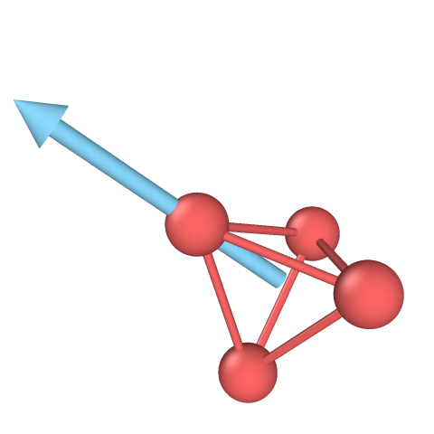
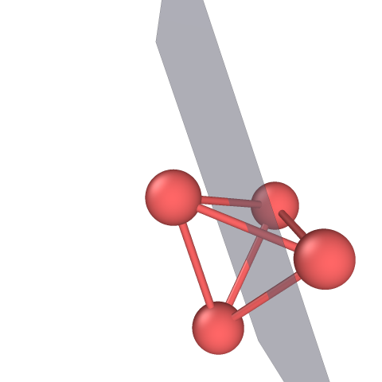
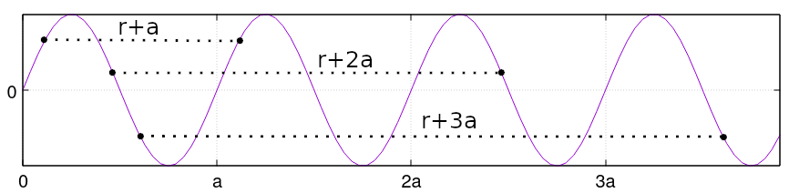
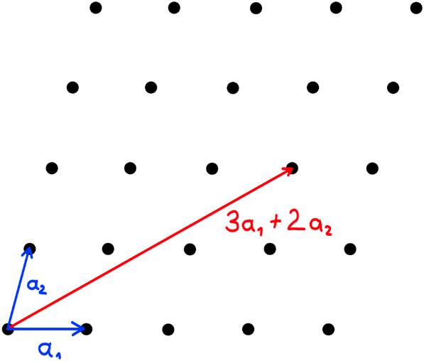
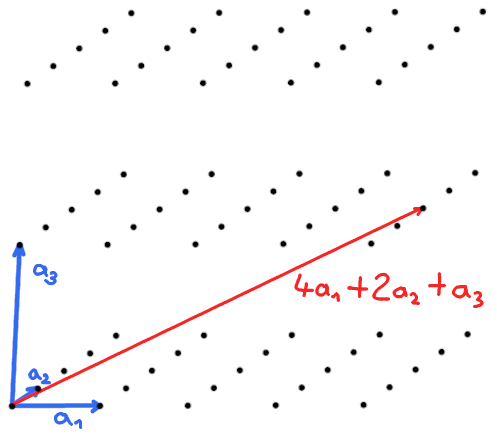

# Introduction to crystallography

## Symmetry operations

A symmetry operation is a geometrical transformation of an object, that leaves the object unchanged.
In mathematical terms, a symmetry operation $\theta$, applied to object $A$ returns the same object:
$$ \theta A = A $$

## Point group operations

The symmetry operations associated to _point groups_ are rotations, reflections, and roto-reflections.

They are represented by orthogonal matrices $\theta$ with real elements, such that $det (\theta) = \pm 1$. In 3 dimensional space, these are 3x3 matrices, where the positive determinant is associated to rotation matrices, and negative determinant to reflections and roto-reflections (combination of rotation and reflection).

Example, rotation for angle $\alpha$ around the $z$-axis:
$$
\mathbf{R(\alpha)} =
 \begin{pmatrix}
 \cos\alpha  &  -\sin\alpha   &  0 \\
 \sin\alpha  &   \cos\alpha   &  0 \\
 0           &   0            &  1
 \end{pmatrix}
$$

In the following figure, a perfect tetrahedron is represented. There are 24 symmetry operations in a tetrahedral shape (point group Td), some of them are (left) rotation around an axis, (middle) reflection over a plane, and (right) combination of reflection over a plane, and rotation about the axis given by the same plane.

They are called _point_ group because they preserve a single point unchanged (the origin).

## Translational symmetry

If the object is infinitely periodic, then the translation by an integer multiple of the unit of repetition is a symmetry operation.

For example, wave with wavelength $a$ is periodic over integer multiples $n$ of $a$:
$$exp(ir) = exp(i(r+na))$$

## Bravais lattice

We set up a set of periodic points in space, called a Bravais lattice.
The unit of periodicity is set by three vectors (in three dimensions),
$\mathbf{a}_1$,
$\mathbf{a}_2$, and
$\mathbf{a}_3$;
their integer multiples prescribe the location of a point in space, that is called a _lattice_ point $\mathbf{R}$:
$$
\mathbf{R} = n_1 \mathbf{a}_1 + n_2\mathbf{a}_2 + n_3\mathbf{a}_3; ~~~n_1, n_2, n_3 \in \mathbb{Z}.
$$

(left) in 2 dimenions, and (right) in 3 dimensions:

The Bravais lattice possesses translational symmetry, if we were to place ourselves at any point of the lattice, the surrounding would look exactly identical on all sides, no matter which point we are at.

## Space group, Crystal classification

On top of that, the point group operations (rotation, reflection) can be symmetry operations on a lattice.
However, the possiblities are limited to $\alpha=...$, such that there are 32 point groups _compatible_ with a periodic lattice. These are called "crystallographic point groups".

The bravais lattices are classified into 7 groups, based on angles and sizes of the three lattice vectors. Adding points/atomic positions P,I,F,S we get 14 classes.

Then we check which point group symmetries are compatible with translation, we get new operations: glide plane, and screw axis.
We also add that the lattice points can have site-specific symmetry, and we end up with a total 230 possibilites, called space groups.

Point groups compatible with a lattice => 32 crystallographic point groups.
Symmetry elements combined with translation.
## space group
Atomic basis vectors, site symmetry.
Compatible elements, 230 groups.
## crystal classes
lattice parameter, c/a, angles
## directions/miller
## unit cell, conventional cell

# Simulations
## periodic boundary conditions (PBC)
put gif;
fractional coords, how to compute pbc, why range -0.5:0.5 rather than 0:1 for distances.
## bloch thm, supercell, kpoints
box boundaries, wavefunction nodes within the sim box.
Reciprocal cell, Brillouin zone.
## bulk, surface, slab
## pitfalls/gotcha
## PES as concept
extrema points, minima, saddles.
Gif of vibrating crystal at T/=0.
