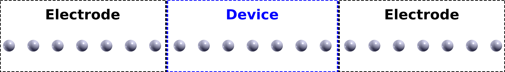
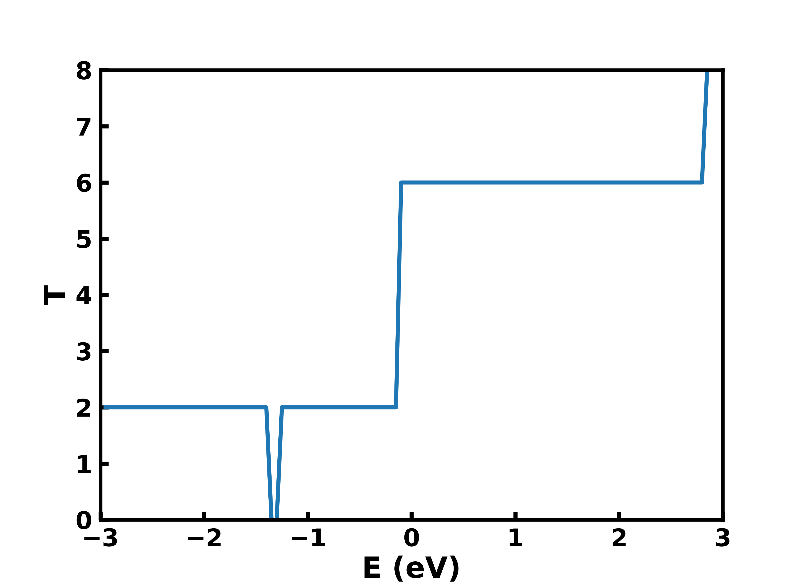
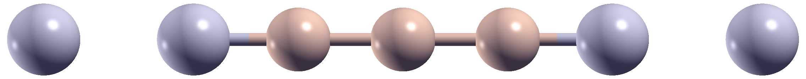
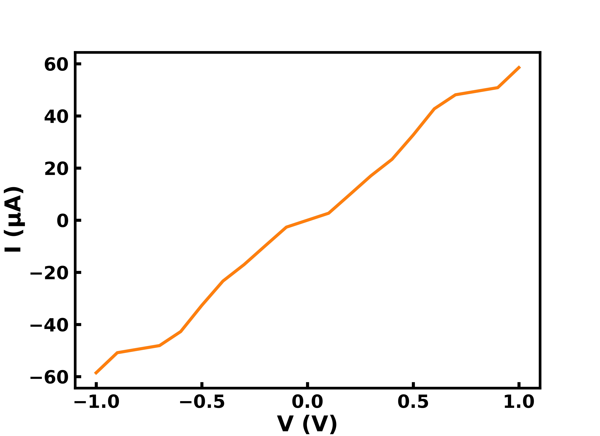
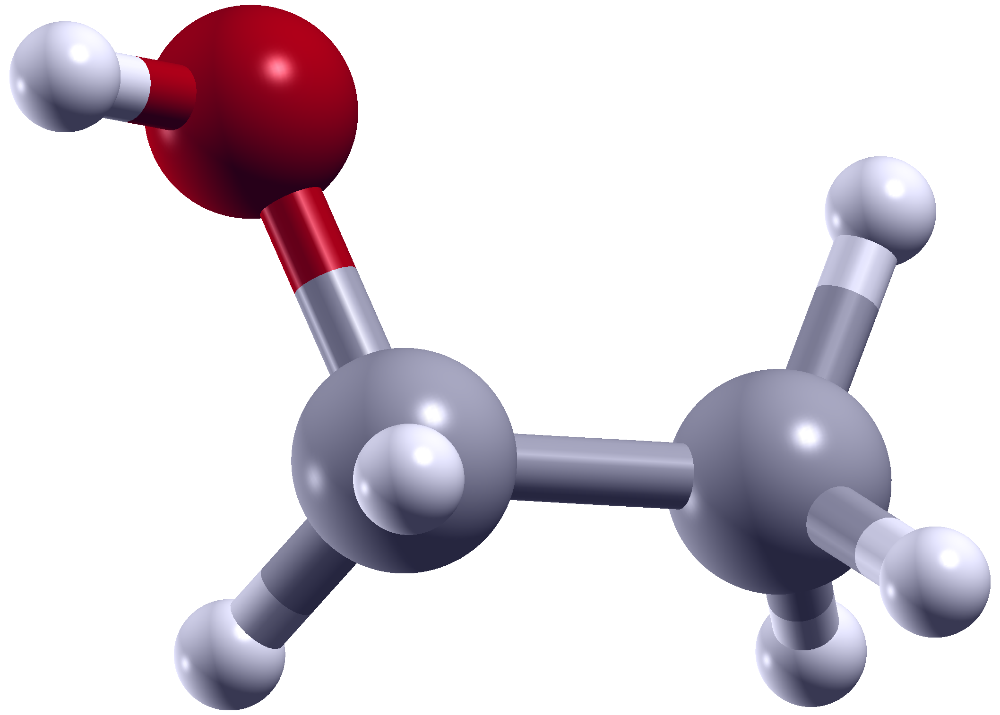
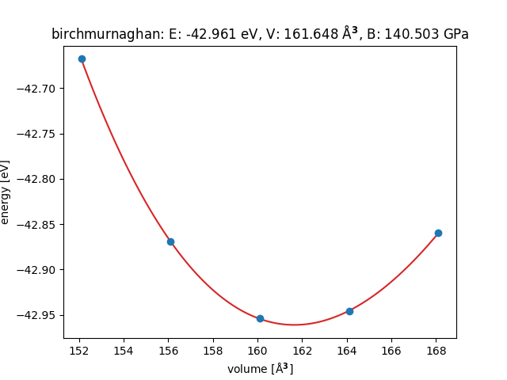
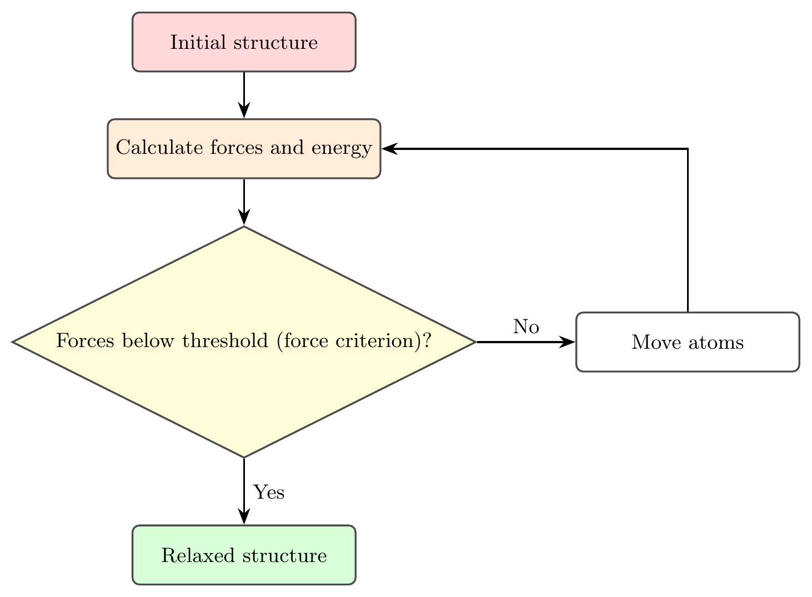
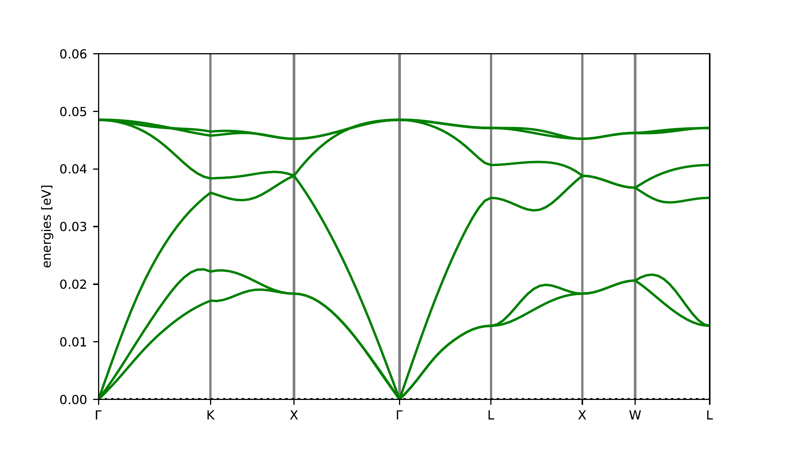

# AMS25 / Day 3 / Hands-on Session

Welcome to the third day of the hands-on sessions at **AMS25!**


> [!IMPORTANT]
> To update the exercises,
> open Terminal using ``Ctrl+Alt+T`` and execute:
> 
> ```bash
> cd ams
> git pull
> ```
> 
> If `git pull` fails due to a merge conflict, you can temporarily stash your changes
> (note that if you care about the changes you made,
> you might want to back them up before executing
> the following commands):
> 
> ```bash
> git stash -u
> git pull
> ```
> 
> If you want to restore the changes, use `git stash pop`.
> If you don't care about the changes you made, you can delete them forever using `git stash drop`.


## Introduction

In this hands-on session you will learn how to perform a simple transport calculation using Quantum Espresso, how to train and fine-tune a 
machine-learning force field using MACE, and, finally, how to perform geometry optimizations, molecular dynamics, and phonon calculations using
MACE machine learning force fields.

#### IPython

IPython is an interactive python interpreter with code highlighting and auto-completion. It can be very useful to test code snippets, or execute python
code without writing an entire script. In the VM, it can be opened by running `ipython` in the terminal.


#### Plotting with Python

```Python
import matplotlib.pyplot as plt
import numpy as np

x = np.arange(-np.pi, np.pi, np.pi/100)
y = np.sin(x)
y_2 = np.cos(x)

plt.plot(x, y, label="sin(x)")
plt.plot(x, y_2, label="cos(x)")
plt.xlabel("x")
plt.ylabel("sin(x)")
plt.xlim(-np.pi, np.pi)
plt.ylim(-1, 1)
plt.legend()
plt.show()
# plt.savefig("plot.pdf")  # save plot to pdf
```

#### Plotting with GNUplot

The following commands let you plot one or two files, respectively, using `gnuplot` (plots can be saved by pressing the export button in the top left
corner). 

```bash
gnuplot -e 'plot "filename" w l' -p
gnuplot -e 'plot "filename" w l, "filename_2" w l' -p
```


## Exercise 1: Electronic transport with Quantum Espresso

In this exercise, we will calculate the electronic transmission for an Al wire and for an Al-Si-Al wire, both consisting of 7 atoms (with the central 3
Al atoms replaced by Si in the second case). We will perform all calculations using the `pw.x` (SCF) and `pwcond.x` (transmission) executables included
in Quantum Espresso.

The following commands can be used to run these codes:

```bash
pw.x -i input_file | tee output_file
pwcond.x -i input_file | tee output_file
```

Important parameters in `pw.x` input files (for complete list see [`pw.x`  Input File Description](https://www.quantum-espresso.org/Doc/INPUT_PW.html#id149):

* `pseudo_dir`: path to the folder containing the pseudo potentials
* `outdir`: directory where `pw.x` output is stored (e.g., charge density and wave-functions)
* `prefix`: prefix for output file names
* `nat`: number of atoms in the cell
* `ntyp`: number of atomic species in cell
* `nspin`: whether SCF calculation is spin-resolved or not
* `ecutwfc`: kinetic energy cutoff for wave-functions (given in units of Ry)

Important parameters in `pwcond.x` input files (for complete list see [`pwcond.x`  Input File Description](https://www.quantum-espresso.org/Doc/INPUT_PWCOND.html#id38):

* `outdir`: same as for `pw.x`; directory where `pwcond.x` looks for the wave-functions of the electrodes and scattering region
* `prefixl` and `prefixr`: prefix for filenames of left and right electrodes (only one needs to be specified if `ikind=1`)
* `prefixs`: prefix for filenames of scattering region
* `ikind`: type of calculation: 
    - 0: calculate only complex band structure
    - 1: perform calculation with same data for left and right electrodes
    - 2: perform calculation with different data for left and right electrodes
* `energy0`: starting energy for calculation of transmission
* `denergy`: energy interval for transmission calculation

At the end of the input file for `pwcond.x`, the following data is specified (each on its own line):

* Number of k-points for which to calculate transmission
* List of k-points for which to calculate transmission
* Number of energy points for which to calculate transmission

#### Pseudopotentials

The pseudopotentials for Al and Si used in this exercise can be found in the `pseudos` folder in the directory for this exercise.


---

### Exercise 1.1: transmission of Al-wire

In this exercise, we will calculate the transmission through an Al wire using `pw.x` and `pwcond.x`. 
The image below shows the setup for the transport calculation.



The input folder for this exercise contains the input files for the SCF and transmission calculations for the Al-wire.

#### Tasks

1. Check the input file for the SCF calculation (`01_Al_wire_scf.in`) and take note of the following parameters: `pseudo_dir`, `outdir`, `prefix`
2. Perform the SCF calculation (`pw.x -i 01_Al_wire_scf.in | tee 01_Al_wire_scf.out`)
3. Fill the missing information in the input file for the transmission (`02_Al_wire_transmission.in`), so that the transmission will be calculated from -3.0 eV to +3.0 eV in intervals
of 0.05 eV (121 energy points). For that purpose, open the file `02_Al_wire_transmission.in` with `mousepad` (`mousepad 02_Al_wire_transmission.in`) or any other text editor
of your choice and replace entries marked `??`.
4. Perform the transmission calculation (`pwcond.x -i 02_Al_wire_transmission.in | tee 02_Al_wire_transmission.out`)
5. Plot the transmission (eg., using `gnuplot` or `python`. How does it look like and why?


#### Solution




---

### Exercise 1.2: transmission of Si between Al-wire electrodes

In this exercise, we will calculate the transmission through an Al-Si-Al wire using `pw.x` and `pwcond.x`. Additionally, we will use the transmission
to calculate the I-V-curve. The device region for this wire is shown below, the electrodes are the same as in the previous exercise.



The current, I, as function of the voltage, V, can be calculated from the transmission as follows (neglecting a factor of 2 for spin):

$$ I(V) = \frac{q}{h} \int_{-inf}^{inf} dE\ T(E)\ [f_1(E, \mu+qV/2) - f_2(E, \mu-qV/2)] $$

Here, $q$ is the elementary charge and $h$ is the Planck constant. In practice, the integral will not run from $-inf$ to $+inf$.
In practice, it is not necessary to perform the integral from $-inf$ to $+inf$, as the difference between $f_1$ and $f_2$ goes to zero for energies far enough outside the bias window (see the slide on thermal
current from the "Theory and Modelling of Electronic Transport" lecture). The bias window being the energy range from $\mu - qV/2$ to $\mu +qV/2$.

The following Python code implements this equation and can be used to calculate the current for one specific voltage:

```Python
from scipy.integrate import trapezoid as integrate

def Fermi(E, mu, T, kb=1.380649E-23):
    return 1 / (1 + np.exp((E - mu) / (kb * T)))

def I_of_V(t, V, T=100):
    """
    Inputs: 
        t: transmission as function of energy T(E) aligned to Fermi-level
        V: bias voltage in Volt
        T: temperature in K
    Output:
        I: current in A
    """
    q = 1.6021E-19  #C
    h = 6.626071E-34  #/Js
    eV = 1.6021E-19  #J
    kB = 1.380649E-23  #J/K
    pre_factor = 2 * q / h  # 2 because of spin

    mu0 = 0  # because transmission is aligned to Fermi-level (chemical potential)
    mu1 = mu0 + q * V / 2
    mu2 = mu0 - q * V / 2
    
    E, tr = t[:, 0] * eV, t[:, 1]
    dF = Fermi(E, mu1, T) - Fermi(E, mu2, T)
    Int = integrate(tr * dF, E)
    I = pre_factor * Int

    return I
```

The following Python code creates a range of x-values using `np.arange`, then loops over those values and calls a function with them as parameter, storing 
the result in an array together with the x-values, and writes the resulting array to a file called `arr.txt`:

```Python
import numpy as np

x = np.arange(-1, 1.001, 0.1)
arr = np.zeros((x.shape[0], 2))
for i, i_x in enumerate(x):
    arr[i, 0] = i_x
    arr[i, 1] = np.exp(i_x)
np.savetxt("arr.txt", arr)    
```

In python and numpy, array data can be loaded from text files as follows:

```Python
import numpy as np
arr = np.loadtxt("arr.txt")
```

#### Tasks

1. Run SCF calculation for the Al-Si-Al wire (with the provided input file: `01_AlSiAl_wire_scf.in`).
2. Copy data for Al-wire from Exercise 1.1 to use as electrode (`cp -r ../E1.1_Al_wire/data/* data/`).
3. Set the `prefixl` and `prefixs` parameters in the `02_AlSiAl_wire_transmission.in` file.
4. Run transmission calculation for Al-Si-Al system with Al electrodes
5. Plot transmission and compare it to transmission for Al-wire from Exercise 1.1. What are the changes?
6. Calculate and plot the I-V curve for V from -1 V to +1 V in 0.1 V intervals.

#### Solution

##### Transmission


##### I-V curve




---

### Advanced tasks

* Calculate the thermal current from the transmission for the Al-Si-Al-wire (hint: set V=0 and provide 2 different temperatures to the two Fermi-functions).
* Calculate I-V curve and thermal current for the pure Al-wire.
* Use a smaller electrode (1, 3, or 5 Al atoms) and recalculate the transmission for the Al-wire from E1.1. What changes? Do the changes make sense
from a physics point of view?


## Exercise 2: Machine learning - training and fine-tuning

> ⚠ **WARNING** All settings used here for the MACE force field are chosen to make the training fast enough for this exercise. They should NOT be used
for the training of a force field that is to be used to calculate properties of real materials. ⚠


### MACE

MACE is a machine learning architecture and code for creating force fields for molecules and materials. Its architecture is based on message-passing
graph neural networks and it uses the atomic cluster expansion (ACE) to represent geometries. For details see:

* [I .Batatia et al, arXiv:2205.06643 (2022)](https://arxiv.org/abs/2205.06643)
* [I .Batatia et al, NeurIPS 35, 11423 (2022)](https://openreview.net/forum?id=YPpSngE-ZU)
* [MACE documentation](https://mace-docs.readthedocs.io/en/latest/)

To run the training, MACE provides a script called `mace_run_train `. This script allows specification of model, training, and dataset parameters.
Important parameters are listed below:

* `--name`: Name of run, will also be prepended to the model filename
* `--train_file`: file containing training data
* `--test_file`: file containing test data
* `--model`: type of model (often `MACE` is used; see MACE documentation for model types)
* `--num_channels`: number of channels per layer of the neural network
* `--max_L`: equivariance of the model
* `--valid_fraction`: fraction taken from test set for validation during training
* `--E0s`: energies of isolated atoms; if set to `average`, MACE will calculate atom energies
* `--r_max`: cut-off radius for interactions between atoms
* `--batch_size`: number of structures loaded simultaneously during training
* `--max_num_epochs`: maximum number of iterations for the training
* `--swa` or `--stage_two`: activate stage tow, in which loss weights for energies and forces are changed in order to improve errors for energies
* `--start_swa` or `--start_stage_two`: number of epochs after which stage two will be activated
* `--energy_key`: name of energy field in data sets
* `--forces_key`: name of field identifying forces in data sets
* `--device`: perform training on CPU (`cpu`) or GPU (`cuda`).
* `--default_dtype`: use single (`float32`) or double (`float64`) precision
* `--seed`: seed for random number generator for initialization


At the beginning of the training of a MACE model, the weights of the neural network and the message function are randomly initialized. Then, the network
is fed with the trainig data to make predictions. These predictions are compared to the true values from the training data to calculate the loss (
according to a predefined loss function). Then the weights and message passing functions are updated according to the loss (backpropagation).
This process is repeated until the loss converges to a small value or a maximum number of training iterations (epochs) is reached.


### Dataset
Ethanol from [revised MD17](https://archive.materialscloud.org/records/pfffs-fff86) data set. Randomly select 300 structures, use 200 for training
and 100 for test set. Another 100 structures were extracted to make predictions in E2.3 using the models trained in E2.1 and E2.2.

---

### Exercise 2.1: train MACE model:

In this exercise, we will train a machine learning model from scratch using MACE. The training set contains 200 ethanol structures with
corresponding forces and energies. These 200 structures were randomly selected from the RMD17 data set. One of these structures is shown here.



The folder `E2.1_training` contains all the files needed for training:

* `train.xyz`: geometries, forces, and energies used for training the model
* `test.xyz`: geometries, forces, and energies used for evaluation of the model
* `mace.sh`: bash script to run the training

#### Tasks

1. Set the paths for the training and test sets in the `mace.sh` script (look for ??? values).
2. Set the number of epochs to 150 and the start for the second stage to 120 epochs (look for ??? values).
3. Run the `mace.sh` to perform the training (type `./mace.sh` in the terminal).
4. When the training is finished, note the errors and how much time the training took (you can find the errors also in the log file in the `log/` directory).


#### Solution

* RMSE Energy: 15.5 meV/atom (first stage); 1.7 meV / atom (second stage)
* RMSE Forces: 58.2 meV/Ang (first stage); 56.8 meV/Ang (second stage)
* Time: approx. 6 minutes (can be very different depending on hardware)

---
 
### Exercise 2.2: fine-tune foundation model:

> Note:
> In this exercise, when running `mace.sh` for the first time, MACE will download the foundation model. Therefore, an internet connection is required
> for this exercise.

In this exercise, we will fine-tune a foundation model using the training and test data sets from Exercise 2.1. There are different ways to fine-tune
a model in MACE (see [Fine-tuning Foundation Models](https://mace-docs.readthedocs.io/en/latest/guide/finetuning.html) and 
[Multihead Replay Finetuning](https://mace-docs.readthedocs.io/en/latest/guide/multihead_finetuning.html) in the 
[MACE documentation](https://mace-docs.readthedocs.io/en/latest/index.html)). Here, we will use the simplest possible way to fine-tune the model, as
described in the section *Naive Fine-tuning* in the [MACE documentation](https://mace-docs.readthedocs.io/en/latest/guide/finetuning.html#naive-fine-tuning).

In the approach we will use for fine-tuning, we only need to specify the `--foundation_model` parameter. This parameter can be set to `small`, `medium`, 
`large`, or be a path to any MACE model. Using one of the first three options tells MACE to fine-tune a model trained on data of the Materials Project.
It will automatically download the appropriate model when running the fine-tuning for the first time. Additionally, the parameter `--multiheads_finetuning`
needs to be set to `False`.

The folder `E2.2_fine-tuning` contains the `mace.sh` script to run the fine-tuning.

#### Tasks

1. Copy the training and test data sets from the previous exercise (`cp ../E2.1_training/*.xyz .`).
2. Set the number of epochs to 25 and the start of the second stage to 15 in the `mace.sh` file (look for `???` values).
3. Run the fine-tuning (type `./mace.sh` in the terminal).
4. Note the errors and training time and compare them to the results of the previous exercise.

#### Solution

* RMSE Energy: 6.4 meV/atom (first stage); 1.8 meV / atom (second stage)
* RMSE Forces: 56.2 meV/Ang (first stage); 51.7 meV/Ang (second stage)
* Time: approx. 3.5 minutes


---

### Exercise 2.3: predicting energies and forces for new structures

This exercise will demonstrate how to predict energies and forces for new structures using a script provided my MACE and will calculate the mean absolute
error (MAE) of the predictions compared to the reference energies.

MACE provides as script called `mace_eval_configs` for predicting energies and forces for a given data set. The most important parameters for this script are:

* `--configs`: specifies the file holding the geometries for which to predict energies and forces
* `--model`: path to the model to use for making predictions
* `--output`: file to which predictions will be written (together with geometries)
* `--device`: whether to run predictions on CPU (`cpu`) or GPU (`cuda`)
* `--default_dtype`: use single (`float32`) or double (`float64`) precision

The folder `E2.3_predictions` contains a set of 100 Ethylene atoms that were not used in training so far.

The mean absolute error (MAE) is calculated according to the following equation (using energies as example):

$$ MAE = \frac{1}{N} \sum_i^N |E_i^p - E_i^{DFT}|$$

Here, $N$ is the total number of geometries for which predictions were made, $E_i^p$ is the predicted energy for geometry $i$, and $E_i^{DFT}$ is the
DFT reference energy for geometry $i$.

The following python snippet can be used to load the predictions and reference data and calculate the differences in predicted to reference energies (
replace filenames `predictions` in the line 2):

```Python
from ase import io
pred = io.read("predictions", format="extxyz", index=":")
target = io.read("new_data.xyz", format="extxyz", index=":")
diffs = []
for p, t in zip(pred, target):
    e_p = p.info["MACE_energy"]
    e_t = t.calc.results["energy"]
    diffs.append(e_p - e_t)
```

Then, the `numpy` functions `numpy.fabs` and `numpy.mean` can be used to calculate the MAE.


#### Tasks

1. Predict energies and forces on new data using the two models from the E2.1 and E2.2, e.g., as shown below for the model from E2.1.
2. Calculate MAEs for the predictions with both models and compare them

```bash
mace_eval_configs --configs new_data.xyz  --device cpu --default_dtype float32 --model ../E2.1_training/MACE_stagetwo.model --output predictions_model_E2.1.xyz
```

#### Solution:

* Model from E2.1: MAE approx. 1.17 meV/atom
* Model from E2.2: MAE approx. 1.15 meV/atom

---


### Advanced tasks:

 - Run the training with different values for the parameters determining the model size (`--num_channels`, `--max_L`, and `--r_max`). How do errors and training times change?
 - Change the maximum number of epochs and the number of epochs after which the second stage is started. How do errors and training times change?
 - Check the MACE documentation regarding multi-head fine-tuning. How do you need to set `--E0s` for this type of fine-tuning?
 - Calculate other types of errors for the predictions in E2.3, such as maximum errors, root mean square errors (RMSE), or mean relative errors (check 
 literature or the internet for error definitions).


## Exercise 3: Machine learning - geometry optimizations and dynamics

In this exercise, we will use a foundation model to relax the structure of Si and use this structure to perform phonon calculations and MD simulations.
We will use Python and ASE for all these calculations.
MACE provides a calculator for ASE, which we will use to obtain energies and forces for the structures and which will drive all the calculations.

MACE provides a calculator for foundation models. It can be imported in Python using:

```Python
from mace.calculators import mace_mp
calc = mace_mp("small", device="cpu")
```

This function takes a few arguments:

* `model`: gives the model size (`small`, `medium`, `large`)
* `device`: where the model should run (`cpu` or `cuda`)
* `default_dtype`: whether the model should use single precision (`float32`) or double precision (`float64`)


### Exercise 3.1: E-V curve for Si

In the exercises of the first and second hands-on sessions, we calculated the energy as a function of volume for Si using an empirical force field and 
with DFT, respectively.
Now, we will do the same using a machine learning potential. Specifically, we will use a MACE foundation model that was trained on the [MPTraj dataset
of the Materials Project](https://figshare.com/articles/dataset/Materials_Project_Trjectory_MPtrj_Dataset/23713842?file=41619375).
This dataset contains 1.6 million structures of bulk crystals covering 89 atomic species.

ASE provides a module for performing equation-of-states fits. We will use this module to fit the E-V curve we obtained with the model to the 
Birch-Murnaghan equation-of-state (see [ASE `EquationOfState` class documentation](https://ase-lib.org/ase/eos.html#ase.eos.EquationOfState) for options and 
references for different equations-of-state). 
The `EquationOfState` class can be imported and used in Python as follows:

```Python
from ase.eos import EquationOfState

equ = EquationOfState(volumes, energies, eos="birchmurnaghan")
v0, e0, B = equ.fit()
```

The `EquationOfState` class takes 3 arguments for initialization:

* `volumes`: list of volumes
* `energies`: list of energies, one energy value for each volume value
* `eos`: the identifier for the equation-of-state that should be used (in our case: `eos="birchmurnaghan"`)

The `EquationOfState` class has 2 methods: 

* `fit`: method to perform equation-of-state fit. Returns optimal volume (`v0`), the energy at the optimal volume (`e0`), and the bulk modulus (`B`).
* `plot`: method to plot E-V curve

The input folder for this exercise contains the structure for Si in a diamond cubic cell (8 atoms), which can be loaded in Python using ASE as follows:

```Python
import ase
si = ase.io.read("Si_diamond_cubic.xyz", format="extxyz")
```

This gives an ASE atoms object, which can be modified for this exercise. The following methods of the ASE atoms object will be useful for this exercise:

* `si.copy()`: returns a copy of an Aotms object called `si`
* `si.set_cell(cell)`: sets new unit cell parameters for the `si` Atoms object. `cell` must be a 3x3 matrix.
* `si.get_cell()`: returns a 3x3 matrix containing the cell vectors of `si`

The following code snippet calculates the energies for 3 different volumes (97.5 %, 100 %, and 102.5 % of reference volume), assuming that the object `si`
contains the Si structure loaded from the provided file (see above on how to read the geometry):

```python
volumes = []
energies = []
cpy_si = si.copy()
for i in [0.975, 1.0, 1.025]:
    f = i ** (1/3)
    si = cpy_si.copy()
    si.set_cell(si.cell * f)
    si.calc = calc
    volumes.append(si.get_volume())
    energies.append(si.get_potential_energy())
```

#### Tasks

1. Calculate the energies for Si with different volumes using the `mace_mp` calculator with a small model: change the volume in 2.5% steps from 95% to 105% of the volume in the given input file.
2. Fit the energy-volume curve to an equation of state and plot the result (use `equ.plot(show=True)`).
3. What is the value for the optimized lattice constant?

#### Solution

* Optimized lattice constant: 5.4474 Ang



---

### Exercise 3.2: Relaxation of Si structure

Geometry optimizations using MACE can be done in ASE. The MACE calculator gives us the forces and energy for a specific structure.
These can then be used to move the atoms in a way to minimize the energy. This procedure is done until a force convergence criterion is met.
The following flowchart illustrates the procedure of a geometry optimization. Since, numerically, forces in many cases cannot become exactly zero,
a force criterion is used to determine when the procedure should be terminated.




The ASE optimize module contains all the tools needed to perform a geometry optimization (see [ASE `optimize` module documentation](https://ase-lib.org/ase/optimize.html#module-ase.optimize).
The following Python code can be used to perform a geometry optimization using the BFGS algorithm:

```Python
import ase
from ase.optimize import BFGS
from mace.calculators import mace_mp

si = ase.io.read("Si.xyz", format="extxyz")
calc = mace_mp("small", device="cpu", default_dtype="float32")
si.calc = calc

opt = BFGS(si)
opt.run(fmax=0.01)  # eV/Ang

si.write("Si_relaxed.xyz", format="extxyz")
```

The input folder for this exercise contains Si in the diamond cell (2 atoms).

#### Tasks

1. Load the Si structure and use the `rattle` function to displace the atoms (e.g., `si.rattle(0.2)`).
2. Run the relaxation using a maximum force criterion of 0.01 eV/Angstrom. How many steps does it take to converge the forces?
3. Reload the structure, displace the atoms more (`si.rattle(1.0)`) and rerun the relaxation. How many steps does it take now for the forces to converge?


#### Solution

* With `si.rattle(0.2)`: it takes 8 steps to converge
* With `si.rattle(1)`: it takes 19 steps to converge. However, the energy is significantly different, because the relaxation ends up in a completely different
and unphysical minimum. This demonstrates that one needs to take care about the initial structure when performing a geometry relaxation.


### Exercise 3.3: Calculation of phonon band structure of Si

In this exercise we will calculate the phonon band structure for Si using the relaxed geometry from E3.2. We will use the [`phonons` module](https://ase-lib.org/ase/phonons.html#module-ase.phonons)
of ASE for this purpose. This module provides th `Phonon` class, which requires an Atoms object and a calculator for initialization. Additionally, 
when initializing this class one can provide a supercell and a displacement for the force calculation. ASE calculated the phonons by displacing each atom
separately in $\pm x$, $\pm y$, and $\pm z$ and calculating forces and energies for all the resulting structures. From the forces and energies,
ASE then calculated the force constants. This approach is called finite difference approximation. The force constants are then used by ASE to
calculate phonons.

To make this exercise more tractable, we provide the (incomplete) python code for phonon calculations:

```Python
import ase
from ase.phonons import Phonons
from mace.calculators ...  # see previous exercise
si = ase.io.read(GEOMETRY_FILE, format="extxyz")

calc = mace_mp(???)  # see previous exercise

# Phonon calculator
N = 5  # Super cell size
ph = Phonons(si, calc, supercell=(N, N, N), delta=0.05)
ph.run()

# Read forces and assemble the dynamical matrix
ph.read(acoustic=True)
ph.clean()

path = si.cell.bandpath('???', npoints=100)
bs = ph.get_band_structure(path)
```


Assuming that the `bs` object holds the phonon band structure calculated with ASE, the following code can be used to plot the band strcuture:

```Python
import matplotlib.pyplot as plt  # noqa

fig = plt.figure(figsize=(7, 4))
ax = plt.gca()

emax = 0.06
bs.plot(ax=ax, emin=0.0, emax=emax)
plt.show()
```


#### Tasks

1. Use the relaxed structure from E3.2
1. Complete the python code for the phonon calculation. For the band path use `GKXGLXWL`.
2. Run the phonon calculation
3. Plot the phonon band structure.

#### Solution



---

### Advanced tasks

* Check the [ASE documentation for the molecular dynamics module](https://ase-lib.org/ase/md.html#module-ase.md). Use the `mace_mp` calculator and the 
relaxed Si structure from E3.2 to perform Langevin (NVT) dynamics at 300 K. Use a supercell-size of 2x2x2 
(hint: ASE atoms objects have a `repeat` function). How long does it take for the temperature to get close to 300 K?
* The ASE molecular dynamics module allows for initializing velocities for MD according to the Maxwell-Boltzmann distribution. Initialize the velocities
for the relaxed Si structure for 300 K and run Langevin dynamics again. How long does it take now to reach 300 K.
* Besides BFGS, ASE provides different algorithms for geometry optimizations. Try different algorithms to relax the Si structure from E3.2 and compare the
results.

